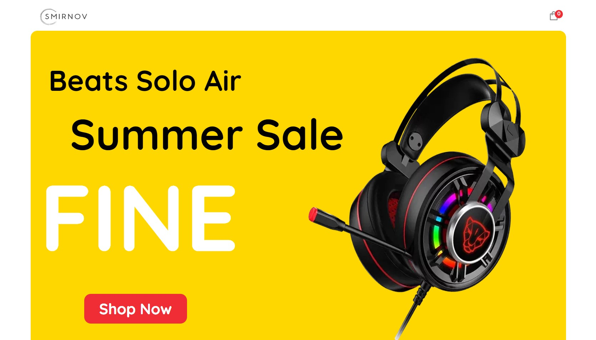
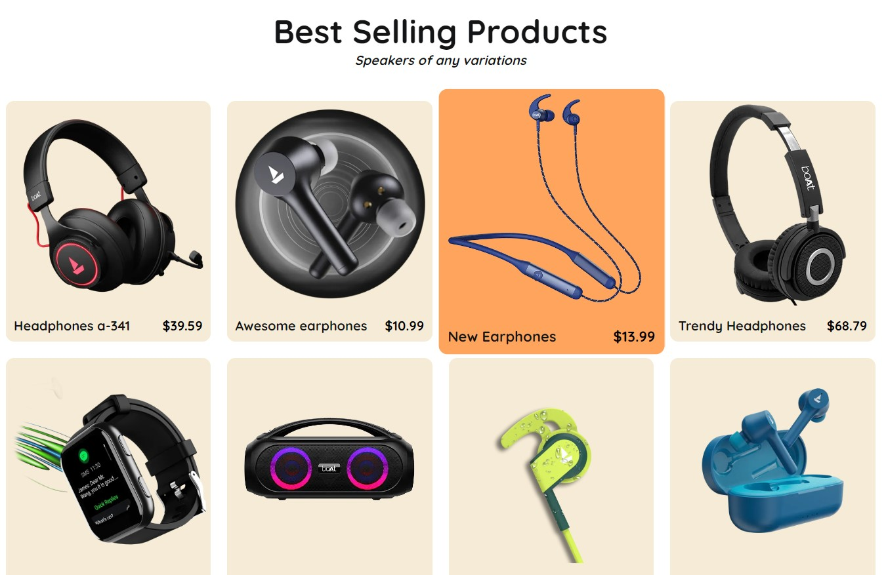
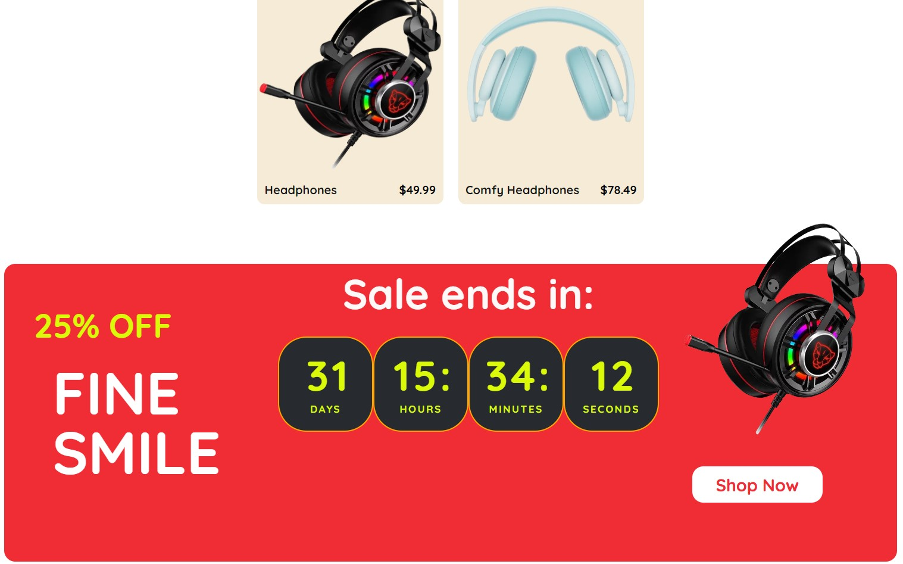
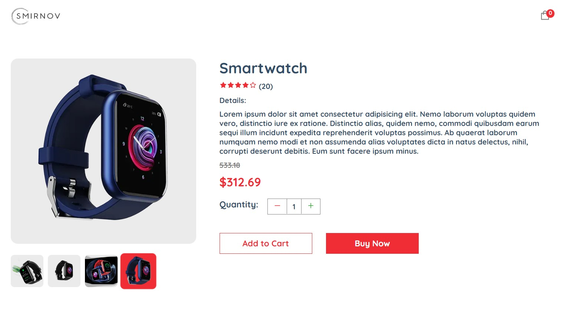
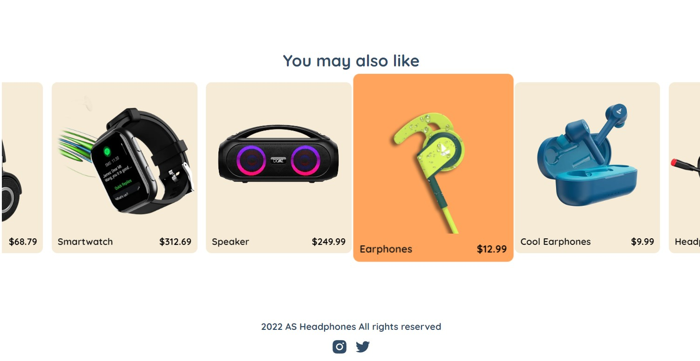
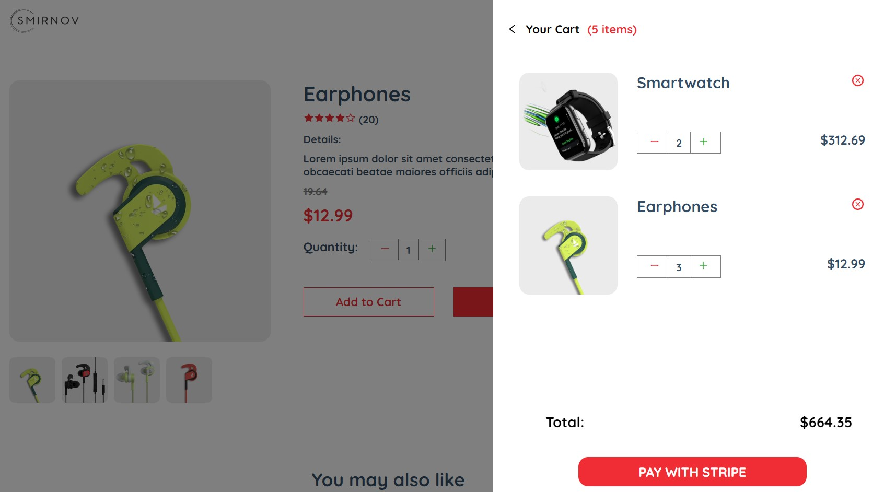
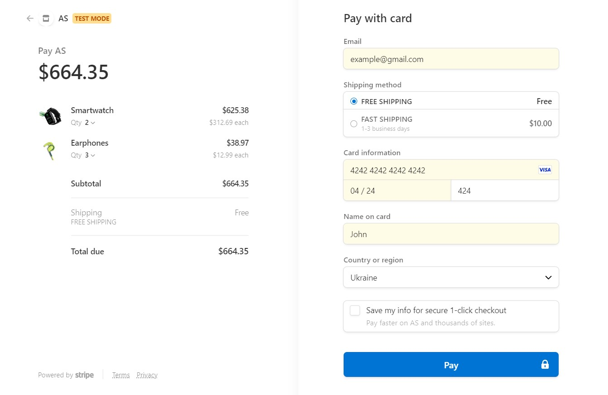
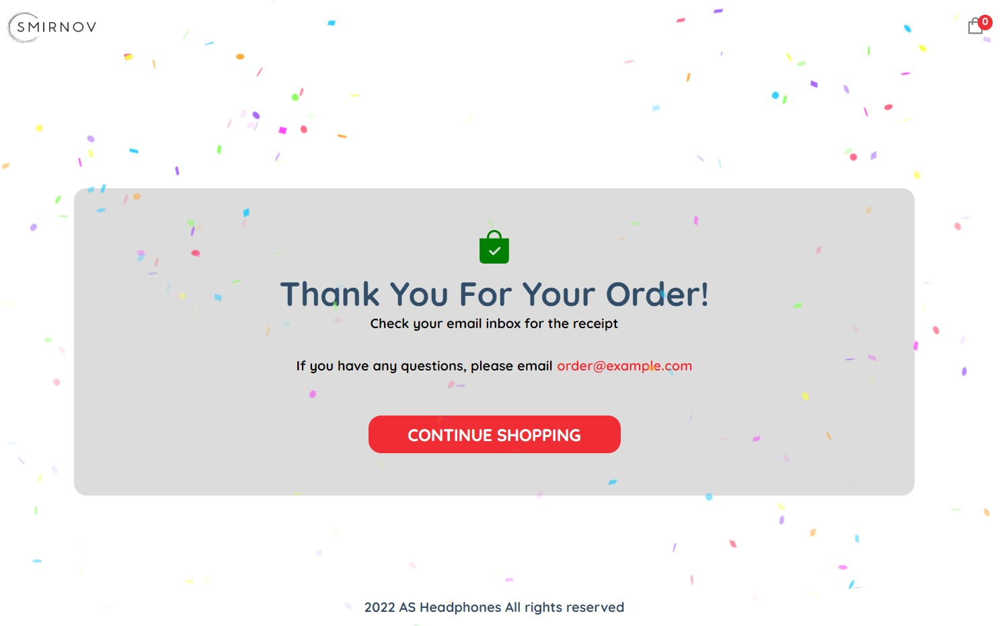
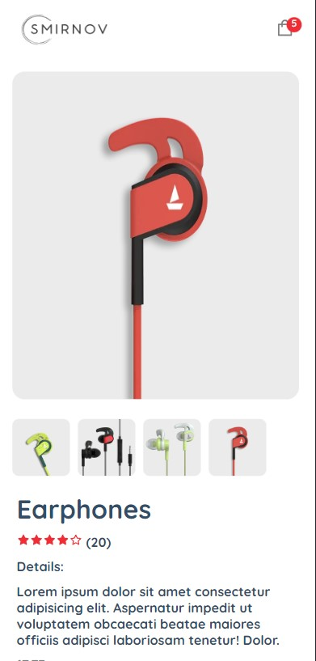

<h1 align='center'>Ecommerce app</h1> 

<h2 align='center'><a href='https://ecommerce-nextjs-nine-flax.vercel.app' target='_blank'> Deployed Project</a></h2> 

## **Description**

Animated E-commerce application on NextJS with integrated capacity to cover real payments
with Stripe. 

On the main page there is a big banner indicating a featured product. Then there is a list of all best- selling products. Each of these products can be dynamically modifies with Sanity CMS.

And at the bottom of this page there is a Sale banner with a Countdown.

Clicking on a specific product will open its product Details page. Here you would find a relevant information and you can also hover over thumbnails to see the images in more detail. You can change the quantity and add the product to the cart. By clicking ‘Buy now’ button or cart icon itself you will open the shopping cart. 

There is also animated ‘You may also like’ section. Hovering over it will stop the animation and you can select another product.

By opening the cart you can modify the quantity of each individual item or remove it from the cart altogether. Even if you reload the page your won't miss anything because everything is stored in Local Storage. 

Finally, when you’re ready to purchase you can click ‘Pay with Stripe’ button. That will lead you to a Stripe checkout.

And once you’re done with the purchase you’ll be redirected to Success page.

The entire website is also completely mobile responsive.

## **Tech stack:**
<ul>
<li>HTML</li>
<li>CSS</li>
<li>JavaScript</li>
<li>React (NextJS)</li>
<li>Sanity</li>
<li>Stripe</li>
<li>Framer Motion</li>
</ul>

This project is scalable, so it would be easy to create a real commercial website
on its basis.
 
